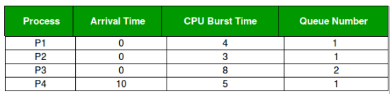
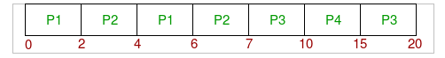

# CPU Schedulers Simulator

A java program to simulate the following schedulers:
1. **preemptive** Shortest-Job First (SJF) Scheduling with context switching
2. Round Robin (RR) with context switching
3. **preemptive** Priority Scheduling (_**Provide a solution to avoid starvation problem**_)
4. Multi level Scheduling:
    
    a. The Schedule consists of 2 queues;
    
    b. The first queue is Round Robin (Quantum will be input);
    
    c. The second queue is FCFS (preemptive);
    
    d. The first queue always has a higher priority. So the second queue starts/resume
        execution only if the first queue is empty;
    
    e. The process input is name, arrival, burst and the queue number(1 or 2);
    
    f. The process doesn't change the queue that it enters.

## Example:
#### Quantum time for the first queue (RR): 2
  
  
#### Answer:
 
 
#### Example Description:
At starting both queues have process so process in queue 1(P1, P2) runs first
(because of higher priority) in the round robin fashion and completes after 7 units
then process in queue 2(P3) starts running (as there is no process in queue 1) but
while it is running P4 comes in queue 1 and interrupts P3 and start running for 5
second and after its completion P3 takes the CPU and completes its execution.

## Program Input

    • Number of processes 
    • Name of each process
    • Burst Time
    • Arrival time
    • Context switching (for question 1 and 2 only)
    • Round robin Time Quantum (for question 2 and 4 only)
    • Priority (for question 3 only)
    • Queue number that the process will enter (for question 4 only)

## Program Output

For each scheduler output the following:

    • Processes execution order 
    • Waiting Time for each process
    • Turnaround  Time  for each process
    • Average Waiting Time 
    • Average Turnaround Time 
